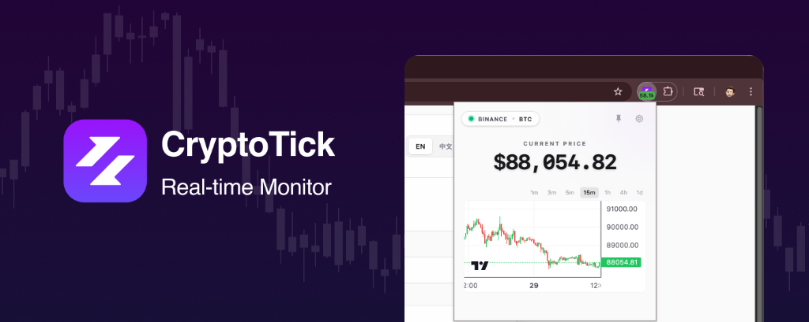

# CryptoTick & Alert - Real-time Price Monitor 🚀

**English** | [中文](./README_ZH.md)

**Real-time crypto prices on your extension icon, smart volatility alerts, and professional candlestick charts.**
Designed for traders and hodlers who need to stay updated without constantly switching tabs.

---

## ✨ Features

* **📈 Real-time Badge Price**: View live prices (BTC, ETH, SOL, DOGE) directly on your browser toolbar icon. Green for up, red for down.
* **🔔 Smart Volatility Alerts**: Set custom thresholds (e.g., "Alert me if BTC moves 2% in 1 minute").
* **🔊 Distinct Audio Cues**: Hear the difference between a **Pump** (Sharp Rise) and a **Dump** (Deep Fall) instantly.
* **📊 Interactive K-Line Chart**: Built-in professional candlestick chart with multiple timeframes (1m, 5m, 15m, 1h, 4h, 1d).
* **🔄 Dual Exchange Support**: Toggle between **Binance** and **OKX** data sources seamlessly.
* **📌 Pin Mode**: Detach the popup into a minimalist "Always on Top" window for dedicated monitoring.
* **🛡️ Privacy First**: No tracking, no analytics. Connects directly to public exchange APIs.

---

## 🛠️ Installation

### From Chrome Web Store

[Download from Chrome Web Store](https://chromewebstore.google.com/detail/cryptotick-alert/hbbecbhfmhhmhimaaamgljmhokaihkpo)

### Manual Installation (Developer Mode)

1. Download the latest [Release](https://github.com/Ethantao/CryptoTick_Extension/releases).
2. Unzip the file.
3. Open Chrome and navigate to `chrome://extensions/`.
4. Enable **Developer mode** (top right toggle).
5. Click **Load unpacked**.
6. Select the unzipped folder.

---

## ⚙️ Configuration

Click the **Settings** icon in the popup to customize:

* **Target Asset**: Choose from BTC, ETH, SOL, DOGE, PAXG (Gold), etc.
* **Data Source**: Binance or OKX.
* **Alert Thresholds**: Set volatility percentage and time window.
* **Theme**: Light / Dark mode (or follow system).
* **Color Theme**: Switch between Global Standard (Green Up/Red Down) and East Asian Standard (Red Up/Green Down).

---

## 🔒 Privacy Policy

We prioritize your privacy.

* **No Data Collection**: We do not collect or store any personal user data.
* **Local Storage**: Settings are stored locally on your device (`chrome.storage`).
* **Direct Connection**: The extension connects directly to Binance/OKX public APIs. No middleman servers.

See full [Privacy Policy](PRIVACY.md).

---

## 🤝 Contributing

Contributions are welcome! Please feel free to submit a Pull Request.

1. Fork the project
2. Create your feature branch (`git checkout -b feature/AmazingFeature`)
3. Commit your changes (`git commit -m 'Add some AmazingFeature'`)
4. Push to the branch (`git push origin feature/AmazingFeature`)
5. Open a Pull Request

## 📄 License

Distributed under the MIT License. See `LICENSE` for more information.

---
**Enjoying CryptoTick?** Give us a ⭐ on GitHub!
